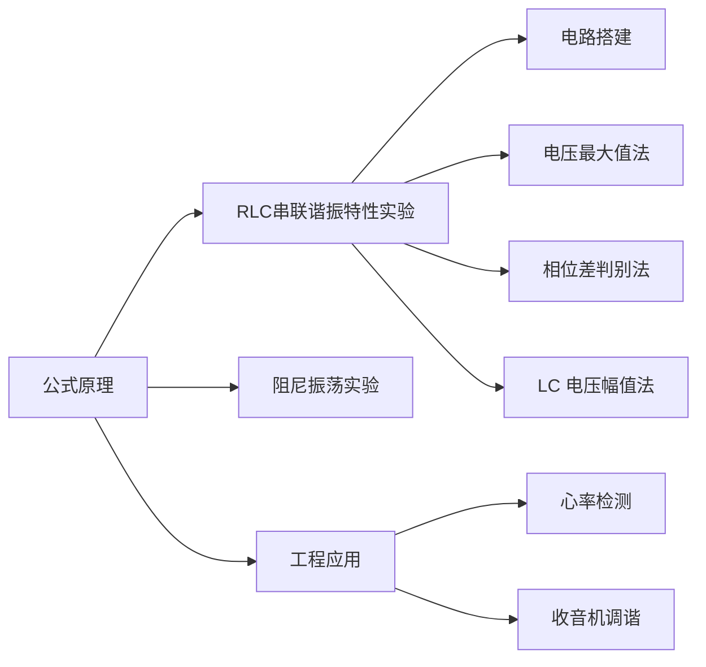

# RLC 串联谐振虚仿平台 · 操作指南

本指南面向首次接触本平台的学生 / 教师，介绍各功能页的定位与推荐操作路线。
平台完全在浏览器中运行，无需安装任何软件，实验数据不上传服务器。

## 1. 平台总览

左侧目录（移动端为抽屉）即全站地图：

| 页面 | 定位 |
| --- | --- |
| 公式原理 | 谐振原理、核心公式与不确定度评定步骤的静态速查 |
| 视频资源 | 串联谐振相关的视频清单，站内直接播放 |
| 电路搭建 | 拖拽元件搭建 RLC 电路并进行仿真实验 |
| 电压最大值法 | 计算结果、三大特性曲线、实测比对与误差分析 |
| 相位差判别法 | 李萨如图示波器判别谐振相位 |
| LC 电压幅值法 | 通过 \(U_L/U_C\) 幅值比与相位协同判定谐振 |
| 阻尼振荡实验 | RLC 阻尼振荡的电路搭建与波形分析 |
| 工程应用 | 心率检测与收音机调谐等工程应用演示 |
| 文档中心 | 本手册与通用 Markdown 查看器 |

## 2. 进入平台

1. 打开地址后先看到**访问验证**页，输入现场下发的 4 位验证码即可进入。
2. 验证状态在当前标签页内保持，刷新不重复询问；关闭标签页后需再次输入。
3. 页眉右侧可切换 **四套配色**（白 / 黑 / 马卡龙 / 绿色），全站页面与图表联动换肤；
   PC 端页眉左侧按钮可折叠目录为仅图标的导轨。

## 3. 推荐实验路线

### 3.1 串联谐振特性实验（核心）

按「搭建 → 测量 → 分析」三步走：

1. **电路搭建**：从左侧元件库拖出信号源、电阻、电感、电容与导线，连成串联回路。
   - 点击板块标题栏的「放大观察」可让工作区**全屏**，便于从容排布元件，按 `Esc` 退出；
   - 不知从何搭起？用**导入示例**一键载入预置的串联 RLC 典型电路。
   - 每次「仿真」会自动存进**仿真历史记录**：该记录表在「电路搭建」页底部与「数据分析」页顶部共用一份，点任一记录即可回填电路与参数（刷新后自动恢复上次选择），完全相同的配置不重复入库。
2. **三种谐振判别法**任选其一深入：
   - **电压最大值法**：扫频寻找 \(U_R\) 峰值，与理论特性曲线比对并做误差分析；
   - **相位差判别法**：观察李萨如图形，相位差为零即谐振；
   - **LC 电压幅值法**：比较 \(U_L\) 与 \(U_C\) 幅值协同判定。
3. 谐振频率的理论值由下式给出：

   \[
   f_0=\frac{1}{2\pi\sqrt{LC}}
   \]

> 提示：**相位差判别法**与 **LC 电压幅值法**两页在后台持续扫频，切到其他页面不会丢失进度，回来即见最新波形。

### 3.2 阻尼振荡实验

同样支持拖拽搭建与板块全屏。切换电阻观察**欠阻尼 / 临界阻尼 / 过阻尼**三种响应波形；
「导入示例」内置三种典型阻尼状态的预置电路，适合课堂快速对比演示。

### 3.3 工程应用

- **心率检测**：RC 电路低通滤波剔除脉搏信号中的高频噪声。
- **收音机调谐**：调节可变电容改变谐振频率，选出台站——直观理解「调台」背后谐振电路的选频作用。

## 4. AI 助手

页面右下角的对话气泡内置 AI 助手，可上传截图提问，适合实验过程中随问随答。

## 5. 文档中心进阶用法

本页自身就是一个通用 Markdown 查看器：

| 操作 | 效果 |
| --- | --- |
| 拖入 `.md` / `.txt` | 新建标签页预览，支持 KaTeX 公式与 mermaid 流程图 |
| 拖入 `.zip` | 自动解压，包内多篇 md 各建一个标签页，相对路径图片正常显示 |
| 拖入 `.pdf` / 图片 | 新窗口原生预览 |
| 点标签页 `+` 或「打开本地」按钮 | 与拖入等效 |
| 导出菜单 | 导出 .md 原文 / .doc（Word）/ .png 快照 / 打印（另存 PDF） |

- 本地导入的文档在**当前标签页内暂存**：刷新页面仍在，点 `×` 关闭即清除；
- 同一份文档重复拖入不会重复建页，会自动定位到已有标签页；
- 较大数据（约 1 MB 以上）或来自压缩包的文档不做暂存，刷新后需重新拖入；
- 长文档右侧自动生成**目录**，点击跳转定位。

---

祝实验顺利！如发现内容疏漏或有改进建议，欢迎通过项目仓库反馈。
